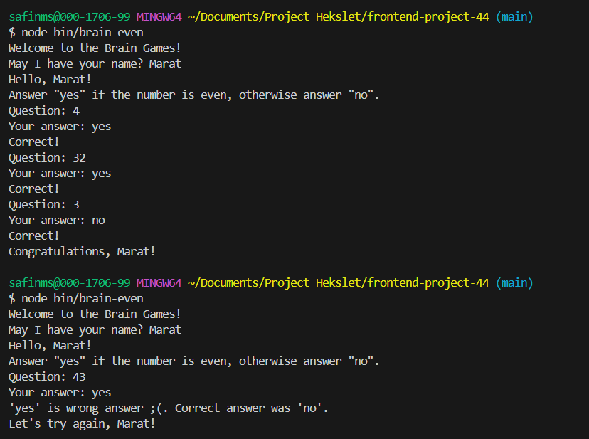
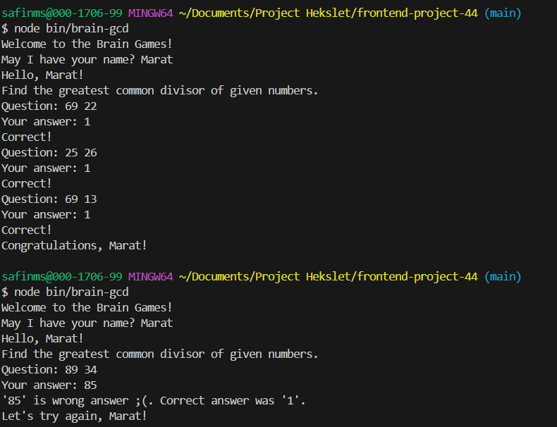
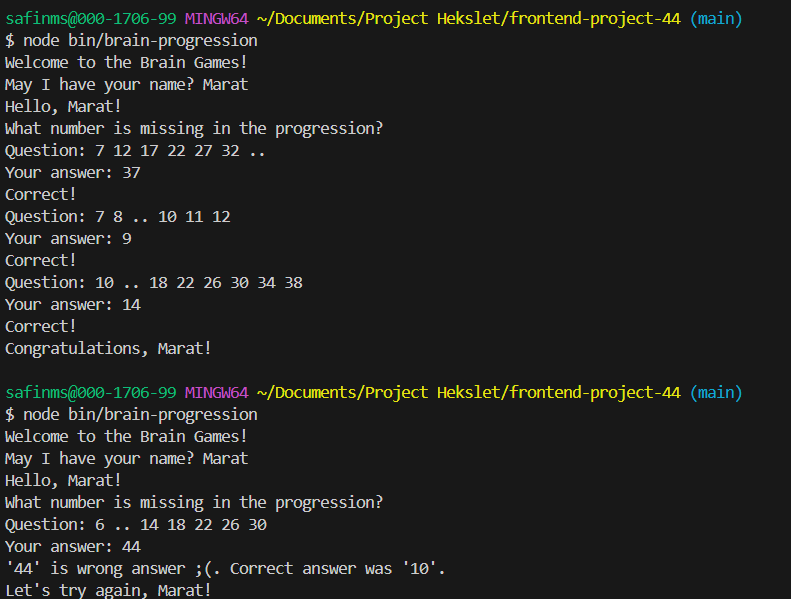

### Hexlet tests and linter status:
[](https://github.com/marat62/frontend-project-44/actions)

[](https://codeclimate.com/github/marat62/frontend-project-44/maintainability)

## Описание проекта 
Набор математических игр

## Запуск игры "Калькулятор"
```
node bin/brain-calc
```
## Запуск игры "Проверка на чётность"
```
node bin/brain-even
```
## Запуск игры "НОД"
```
node bin/brain-gcd
```
## Запуск игры "Арифметическая прогрессия"
```
node bin/brain-progression
```
## Запуск игры  "Простое ли число?"
```
node bin/brain-prime
```

Пример игры "Калькулятор"


Пример игры "Проверка на чётность"


Пример игры "НОД"


Пример игры "Арифметическая прогрессия"


Пример игры "Простое ли число?"


